# 📘 Guías de Programación II

Este repositorio contiene material de apoyo para la **parte teórica** de la asignatura de [Programación II](https://esei.uvigo.es/asignaturas/graoei/programacion-ii-o06-g151109/), en forma de cuestionarios en formato [Markdown](https://en.wikipedia.org/wiki/Markdown).

Metodológicamente, los cuestionarios tienen un doble objetivo:

1. Guiar las clases de teoría presenciales, que tratarán dichas cuestiones en orden.

2. Fomentar que el cuestionario sea respondido **ANTES** de la clase teórica, siguiendo la metodología de "aula invertida".

Para responder a los cuestionarios, se recomienda (1) **responder inicialmente** con IA generativa, como [ChatGPT](https://chat.openai.com/), [Gemini](https://gemini.google.com),  [GitHub Copilot](https://github.com/features/copilot), etc., (2) **verificar** las respuestas con recursos online, bibliografía y (3) **adaptar** las respuestas mediante ediciones personales y/o apoyo de IA generativa. Al final, estos cuestionarios servirán como apuntes para preparar la prueba teórica de la asignatura.

A nivel técnico, las respuestas deben redactarse en formato [Markdown](https://en.wikipedia.org/wiki/Markdown), un lenguaje de marcado sencillo y ampliamente utilizado en las IA generativas (que generan este formato para mostrar respuestas con texto que incluye formato, emojis, tablas, etc.). Para más información sobre Markdown, se puede consultar [esta guía](https://www.markdownguide.org/).

## 🔄 Metodología de trabajo

Este repositorio sigue una metodología estructurada que combina el aprendizaje autónomo con la evaluación continua. El proceso incluye un ciclo iterativo semanal donde:

1. **Profesor**: Publica nuevas preguntas 5 días antes de cada clase
2. **Estudiante**: Hace pull, responde con IA generativa, genera PDF y asiste a clase
3. **Consolidación**: Mejora apuntes y realiza commits obligatorios semanales
4. **Evaluación**: El profesor evalúa la actividad mediante el historial de commits

📋 **[Ver metodología completa y diagrama de flujo →](METODOLOGIA.md)**

## ✨ Ventajas del enfoque

1. **Organización estructurada**: El uso de cuestionarios fomenta un aprendizaje guiado y enfocado en los temas clave de la asignatura. 📚
2. **Formato accesible**: Markdown es un lenguaje sencillo, ampliamente utilizado y compatible con múltiples herramientas, facilitando la edición y el intercambio de apuntes. 📝
3. **Aprendizaje activo**: Responder preguntas promueve la investigación y la comprensión activa de los conceptos. 🔍
4. **Apoyo de IA generativa**: Herramientas como GitHub Copilot o ChatGPT agilizan la creación de contenido, ofrecen ejemplos prácticos y ayudan a resolver dudas. 🤝
5. **Gestión eficiente con Git**: Utilizar Git para gestionar los apuntes permite aprender esta herramienta clave en entornos profesionales, además de facilitar el control de versiones, la recuperación de cambios anteriores y la mejora continua mediante commits. 🗂️
6. **Personalización**: Los apuntes generados son adaptables a las necesidades y estilo de aprendizaje de cada estudiante. 🎨
7. **Preparación para el futuro**: Este enfoque familiariza con herramientas modernas y metodologías útiles en entornos profesionales. 🚀

## ⚠️ Advertencia sobre el uso de IA generativa

Aunque las herramientas de IA generativa como ChatGPT o GitHub Copilot resultan claves en este método, es fundamental verificar las respuestas generadas, especialmente en temas sobre los que no se tiene un conocimiento profundo. Las IAs pueden cometer errores o generar contenido impreciso.

### ✅ Consejos para verificar las respuestas

1. **Consultar fuentes confiables**: Contrastar las respuestas con libros de texto, documentación oficial o recursos académicos recomendados. 📖
2. **Probar los ejemplos de código**: Si la respuesta incluye código, ejecutarlo en un entorno controlado para asegurar que funciona como se espera. 🖥️
3. **Consultar con expertos**: En caso de dudas, recurrir a profesores, compañeros o foros especializados. 👩‍🏫👨‍🏫
4. **Revisar el razonamiento**: Verificar que las explicaciones sean lógicas y estén alineadas con los conceptos estudiados. 🤔
5. **Reforzar el aprendizaje**: El proceso de verificación no solo asegura la precisión de las respuestas, sino que también ayuda a profundizar en los temas y consolidar la comprensión. 💡

## Recomendaciones para responder a los cuestionarios con IA generativa

- Se recomienda utilizar un prompt que indique a la IA tanto los conocimientos previos como la longitud esperada de las respuestas.
- Una longitud de respuesta adecuada es de entre 2 a 4 párrafos, excluyendo los ejemplos de código.
- Es aconsejable utilizar Git para gestionar los apuntes, ya que permite llevar un control de versiones, recuperar cambios anteriores y colaborar fácilmente si es necesario [Ver instrucciones de Git](#instrucciones-básicas-para-usar-gitgithub).

### 🌐 Alternativa 1: empleo de IAs generativas vía web

Esta alternativa consiste en utilizar la web de una IA generativa como [ChatGPT](https://chat.openai.com/) o [Gemini](https://gemini.google.com), abierta en el navegador de forma paralela al editor de texto.

El flujo de trabajo sería el siguiente:

1. Establecer un prompt inicial en un chat con la IA, que defina el contexto del estudiante (conocimientos previos) y la longitud esperada de las respuestas.
2. Copiar cada pregunta y obtener las respuestas de la IA.
    - Se puede emplear la utilidad de "canvas" que muchas de estas IAs ofrecen, para que las respuestas queden en una especie de documento al margen.
3. Obtener el Markdown de las respuestas. Tanto si se usa canvas como si se usa el propio chat, en este paso **no se debe seleccionar y copiar directamente sobre el resultado** mostrado en pantalla, sino que debe usarse la utilidad de copiar que estas IAs dejan al final de sus respuestas (o un icono, o un menú contextual, por ejemplo), puesto que cuando se utiliza esta función **lo que se copia al portapapeles es el formato Markdown en crudo**, que es lo que interesa.

**Ventajas:**
- No requiere instalación de herramientas adicionales.
- Accesible desde cualquier dispositivo con navegador.
- Interfaz intuitiva y fácil de usar.

**Desventajas:**
- Limitaciones en la personalización del entorno de trabajo.
- Puede ser menos eficiente para iterar rápidamente entre preguntas y respuestas.
- Dificultades para continuar trabajando con cuestionarios a medio responder o que se quieran mejorar con ayuda de la IA.

### 🛠️ Alternativa 2: editar el markdown con IA integrada (ej: VSCode + Copilot)

En esta alternativa, todo el trabajo se realiza dentro de un entorno de programación, como [VS Code](https://code.visualstudio.com/), utilizando [GitHub Copilot](https://github.com/features/copilot). Esta herramienta de IA generativa puede asistir editando el Markdown con aportaciones, respondiendo preguntas sobre el cuestionario abierto, proporcionando ejemplos adicionales, o incluso generando posibles preguntas de examen relacionadas con el cuestionario.

**Ventajas:**
- Integración directa con el editor de texto, lo que permite un flujo de trabajo más fluido.
- No requiere cambiar entre aplicaciones o ventanas.
- Mayor personalización del entorno de trabajo (extensiones, temas, etc.).

**Desventajas:**
- Requiere instalación y configuración previa de herramientas como VS Code y GitHub Copilot.
- Puede tener una curva de aprendizaje inicial para quienes no estén familiarizados con entornos de desarrollo.
- Dependencia de una suscripción activa para GitHub Copilot, aunque los [estudiantes universitarios](https://github.com/education/students) pueden solicitar una suscripción gratuita al Copilot PRO, que permite, por ejemplo, un uso ilimitado a su modelo base (a día de hoy, GPT 4o).

### Instrucciones básicas para cubrir cuestionarios usando además Git/GitHub

Es necesario contar con una cuenta en GitHub. A continuación, se describen los pasos básicos para gestionar los apuntes con Git:

#### Una única vez al comenzar el curso:

1. **Realizar un fork del repositorio**  
   Acceder al repositorio original en GitHub y hacer clic en el botón "Fork" para crear una copia en la cuenta personal.

2. **Clonar el fork en la máquina local**  
   Copiar la URL del fork y clonarlo en la máquina local utilizando el siguiente comando:
   ```bash
   git clone <URL_DEL_FORK> #ej: git clone https://github.com/usuario/guias-programacion-mifork
   
   # suponiendo que el fork se llama "guias-programacion-mifork"
   cd guias-programacion-mifork
   ```

3. **Definir el repositorio original como upstream**  
   Configurar el repositorio original como `upstream` para poder obtener actualizaciones en el futuro (por ejemplo: nuevos cuestionarios de cada semana):
   ```bash
   git remote add upstream https://github.com/GID-IAXPRO/guias-programacion.git
   ```
#### Trabajo diario:
1. **Comprobar si el profesor ha subido un nuevo cuestionario (o cualquier otro cambio)**
   Para ello, lo que se hace es ejecutar pull sobre el remoto `upstream`. Se ejecuta el siguiente comando:
   ```bash
   git pull upstream main --no-rebase --no-edit
   ```
   Esto traerá los cambios de la rama principal del repositorio original y los integrará en el repositorio local.

2. **Editar los archivos y realizar commits**  
   Para editar los ficheros, **lo recomendable es copiar el cuestionario** a la subcarpeta `doc/respuestas`. De esta forma, podrás conservar siempre el cuestionario original, **se evitan conflictos de git** con los cambios que hace el profesor, y permite responder incluso de varias formas un mismo cuestionario (por ejemplo: con y sin IA generativa). Por ejemplo, copiar `doc/enunciados/fichero.md` a `doc/respuestas/fichero-gpt4.1.md`.

   ```bash
   cp doc/enunciados/tema_1_clases_y_objetos.md doc/respuestas/tema_1_clases_y_objetos_gpt4o.md
   ```

   Realizar los cambios necesarios en los archivos que tengas en `doc/respuestas`. Luego, añadir y guardar los cambios con los siguientes comandos:
   ```bash
   git add .
   git commit -m "Respondidas a las preguntas 1 a 4 del Tema 1"
   ```

3. **Subir los cambios al fork**  
   Subir los cambios al repositorio en GitHub:
   ```bash
   git push origin main
   ```

## Instrucciones para generar PDF (opcional) 🖨️

De cara a imprimir, exportar, o simplemente visualizar en cualquier dispositivo el formato Markdown de forma amigable, se puede generar un fichero PDF.

Si bien se pueden emplear herramientas externas para generar documentos PDF, o extensiones de VSCode (recomendable: [Markdown Preview Enhanced](https://shd101wyy.github.io/markdown-preview-enhanced/#/)). No obstante, este repositorio incluye unas instrucciones para generar los PDFs directamente de **todos aquellos ficheros markdown que se encuentren en la carpeta `doc/respuestas`**.

### Requisitos 📦

Antes de comenzar, se debe contar con lo siguiente:

- [Conda](https://docs.conda.io/en/latest/) (Anaconda o Miniconda).

#### Usuarios de Windows 🪟

Si se utiliza Windows, se recomienda configurar el entorno utilizando WSL (Windows Subsystem for Linux). Los pasos son los siguientes:

1. **Instalar WSL**  
   Abrir PowerShell como administrador y ejecutar:
   ```bash
   wsl --install
   ```
   Reiniciar la máquina si es necesario.

2. **Configurar una distribución de Linux**  
   Una vez instalado WSL, seleccionar e instalar una distribución de Linux (como Ubuntu) desde la Microsoft Store.

3. **Instalar Conda en WSL**  
   Descargar e instalar Miniconda dentro del entorno WSL siguiendo las instrucciones para Linux disponibles en [Miniconda](https://docs.conda.io/en/latest/miniconda.html).

4. **Clonar el repositorio y seguir las instrucciones**  
   Una vez configurado WSL y Conda, seguir las instrucciones principales de este README desde el entorno WSL.

### Pasos 🏁

1. **Crear y activar un entorno conda**  
   Crear y activar un entorno conda utilizando el archivo `environment.yml` incluido en el proyecto, en la subcarpeta `pdf`:
   ```bash
   cd pdf
   conda env create -f environment.yml
   conda activate guias-programacion
   ```

2. **Editar los cuestionarios**  
   Como se ha comentado antes, los ficheros de preguntas deben copiarse desde la carpeta `doc/enunciados` a la carpeta `doc/respuestas`. Una vez copiados, editar los archivos en `doc/respuestas` para responder a las preguntas.

3. **Generar los PDF**  
   Una vez editados los cuestionarios, utilizar `make` para generar los PDFs:
   ```bash
   make
   ```
   Tras ello, en la carpeta `pdf/build` estarán los ficheros PDF.

   **Nota**: El sistema incluye soporte automático para **diagramas Mermaid**. Si tus archivos Markdown contienen diagramas Mermaid (usando bloques de código `mermaid`), el sistema instalará automáticamente las dependencias necesarias la primera vez que ejecutes `make`.

### Uso de Diagramas Mermaid 📊

Para incluir diagramas en tus respuestas, puedes usar la sintaxis de Mermaid:

```mermaid
graph TD
    A[Inicio] --> B{¿Condición?}
    B -->|Sí| C[Acción 1]
    B -->|No| D[Acción 2]
    C --> E[Fin]
    D --> E
```



Los diagramas se convertirán automáticamente a imágenes en los PDFs generados.

Para mejorar la experiencia de edición de archivos Markdown con diagramas mermaid, se recomienda instalar la extensión [Markdown Preview Mermaid Support](https://marketplace.visualstudio.com/items?itemName=bierner.markdown-mermaid)


### Notas 📝

- El archivo `environment.yml` incluye todas las dependencias necesarias, como `pandoc` y `tectonic`, para convertir los archivos Markdown a PDF.
- **Soporte para Mermaid**: El sistema detecta automáticamente si necesitas generar diagramas Mermaid e instala las dependencias necesarias (`@mermaid-js/mermaid-cli` y `pandoc-mermaid-filter`) sin intervención manual.
- Si se necesita personalizar el estilo del PDF, se pueden modificar los archivos de configuración o las reglas en el `Makefile`.

